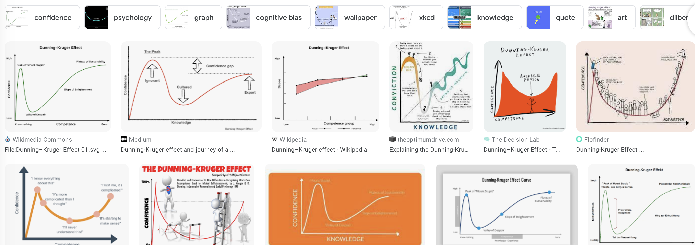
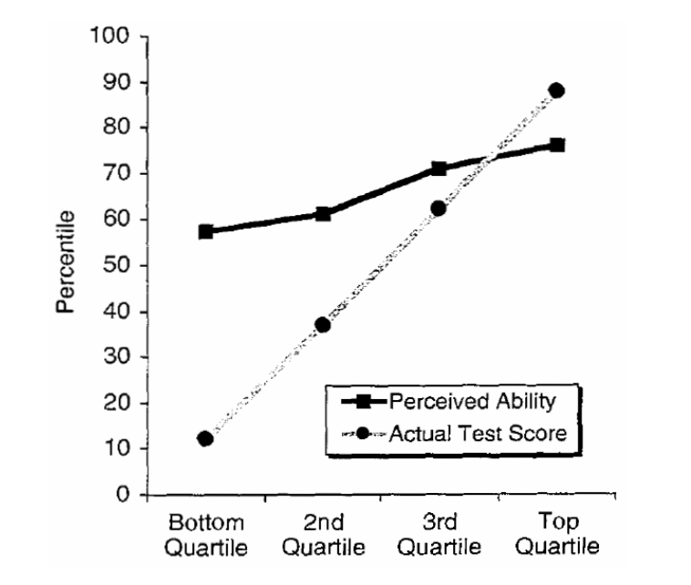
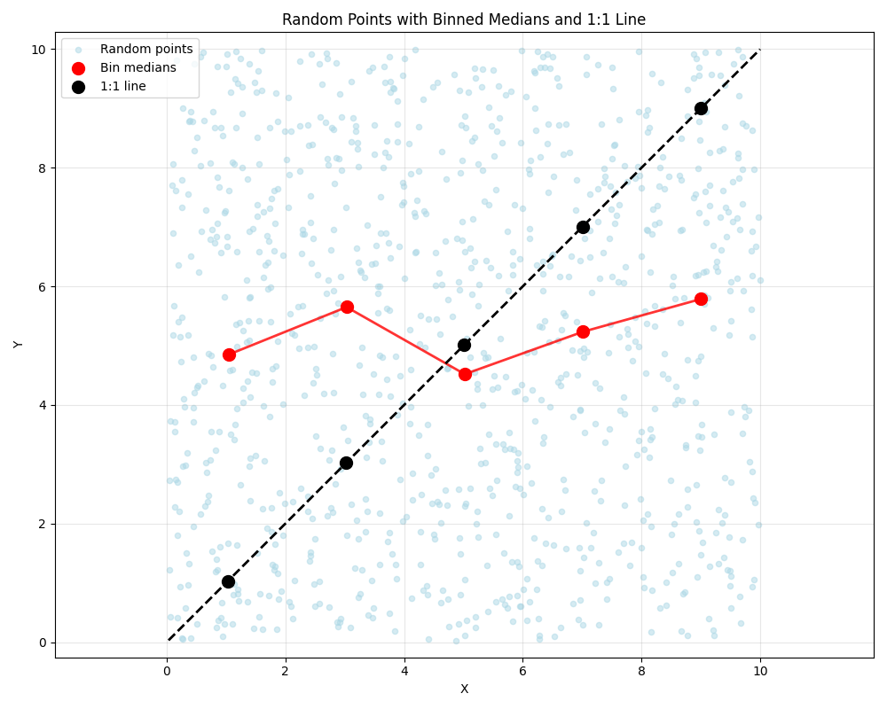
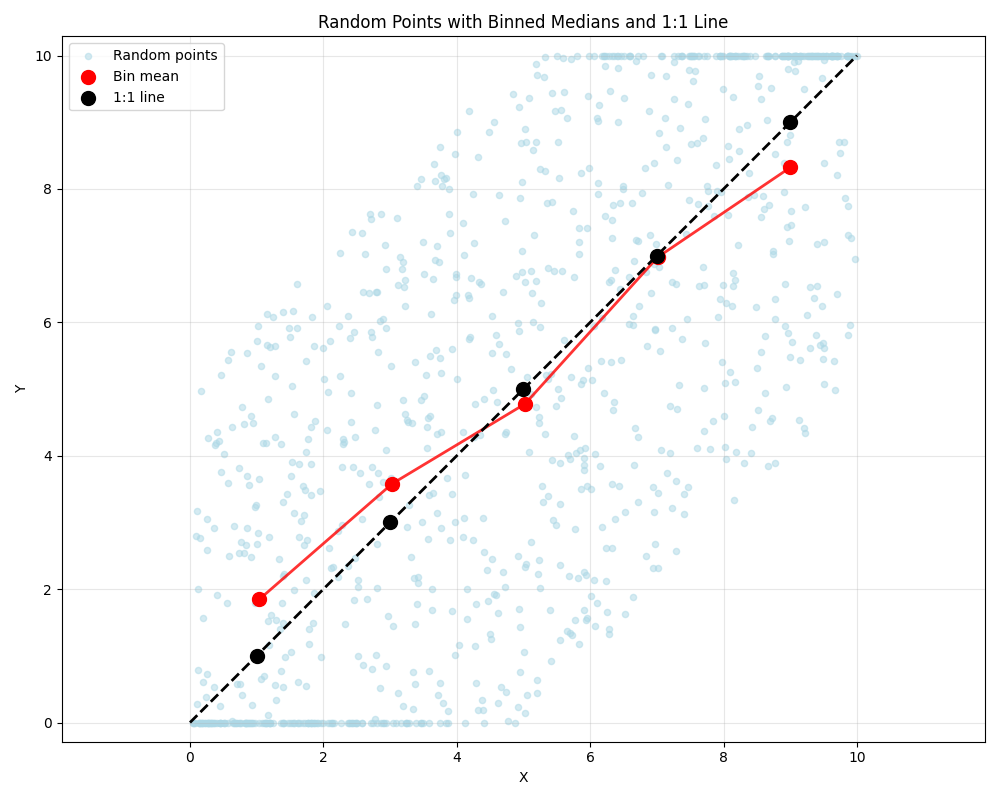

If you’ve ever had the misfortune of finding yourself in the midst of a heated internet “debate”, chances are you know about the Dunning-Kruger effect. Often used, and more often mis-used, in an effort to disqualify one’s opponent, it is quite probably one of the most famous cognitive biases in psychology.
Roughly, the result is summarised like this: the unskilled will overestimate their own competence, whereas the skilled will underestimate their own competence.

I think both extremes of this contribute to the popularity of the effect and why it has essentially become an internet-law (alongside Godwin’s law, Rule 34 and Poe’s Law): it’s tempting to derive a false sense of modesty from it (“I don’t feel very competent about this topic - that’s surely a sign of my competence!”) and it serves as an explanation for people’s overconfidence in online debates.

If you knew all this already: forget everything you thought you knew about this. Seriously: chances are what you think you know is wrong.

Have a look, for instance, at what happens when you google the effect:

A vast majority of these graphs show (qualitatively) the same thing: with “knowledge” (or something similar) on the x-axis and “confidence” (or something similar) on the y-axis it shows an early peak in confidence at low levels of knowledge (famously dubbed "mount stupid”). The confidence then drops off sharply, only to grow again as people gain more knowledge (and, supposedly, have a more accurate picture of their own skill).

The problem: of the 11 top hits, only one (top row, third from the left) has anything at all to do with the actual effect as described in Dunning & Kruger 1999 (and replicated in a large number of similar experiments since). For as much as I can tell, the non-linearity is a fantasy, an internet-invention, that has nothing to do with science.

## Dunning-Kruger (1999)
So let's have a look at the actual publication. In their 1999 publication, Dunning & Kruger performed a series of tests (in humor, logical reasoning and English grammar) with their subjects, and asked them to do a self-assessment of their ability. For each quartile of actual test performance, they then plotted the average test score (a 1-to-1 diagonal by definition) and the average self assessment. One such result looks like this:

(Two of the four experiments don't show such a clear positive correlation but show little correlation if at all).

A very compelling result indeed! What’s more: this has been shown again and again in different studies by different authors. Neat! So there we have it: scientific results warped by the internet, but still a law I can wack my Twitter adversaries over the head with, right?

Well... not exactly. The interpretation of these results have been extensively discussed in the academic literature, but a consensus does not exist.

The canonical explanation is that of metacognition: low-performers not only perform low on cognition (knowing the answer) but also on metacognition (the ability to correctly assess their performance).

I have to confess: I am biased against this explanation. I have only read a handful of papers on the topic so having a strong opinion on this could be an ironic hubris considering the subject matter, but I see no reason why students with a bad test score would _also_ score poorly on metacognition. After all, someone scoring $0$ points because they have absolutely no clue would know that - they would not score low on the metacognitive task. This is no different from someone acing the test and knowing they aced the test: metacognitively they are equal.
For those students in between, getting some answers right, some answer wrong, they might assess themselves to be perfectly average students. The student that _actually_ falls in the 50th percentile would happen to be right, but it seems implausible to me that that is because of superior metacognition.

In other words: without knowing anything about other students, the only way to have any sort of metacognitive certainty is by performing very well or very poorly. Dunning & Kruger say 

> Once top-quartile participants learned how
poorly their peers had performed, they raised their selfappraisals to more accurate levels.

which, to me, simply reads as _everyone_ being ignorant of their relative performance. For average students that just happens to be correct.

For all these reasons and more, it is unfortunate that only the averages are shown / available. The higher-order moments in data like this would be highly interesting for the interpretation of these results.

The most compelling alternative, in my opinion, is provided by work from Nuhfer et al. (2016, 2017). In those papers, the authors argue that the Dunning-Kruger effect is merely a statistical artifact.

Some of this can be compellingly understood with some simple simulations. In the graph below, I generate $1000$ _random_ (x, y) values. This thus represents complete metagonitive ignorance. Because of this, the median is flat and this "X"-pattern in the comparison to the diagonal is immediately evident.

Considering that with perfect information the self-evaluation would be equal to the actual performance (i.e. a diagonal), a linear combination of the flat signal from random noise plus the 1-1 from perfect assessments explains the observations: some signal and a whole lot of noise.

There are other potential artifacts, such as a _ceiling effect_: there is a natural upper- and lower limit to test scores, which skews the data at the high- and low end. Effectively, this means the  highest quantiles are averaged down (you can't score better than perfect) and the lowest quantiles are averaged up (you can't score worse than 0).

I simulated this in the figure below:

This time, we assume that $x$ and $y$ _do_ correlate, but with some scatter. As discussed, we then apply the ceiling effects to it, and take the average. As suspected, this flattens the curve in red. Without the ceiling effects, this would definitially be a 1-1 relationship, overlapping the black line.

Importantly, this only shows up if we take the _mean_ rather than the _median_ (the median is, after all, insensitive to ceiling effects). It is unclear from the original Dunning & Kruger paper which they use and thus whether or not ceiling effects are relevant.

## Conclusion
In conclusion, the Dunning-Kruger effect seems to have multiple layers of irony: an overconfidence onion. There is the effect as defined by the internet, for which there is no evidence whatsoever. Then there is the original research, which is contentious to say the least. Then there is the criticism that it is basically a matter of numeracy. And then there is me, probably overconfident as well based on my limited research in the topic.
