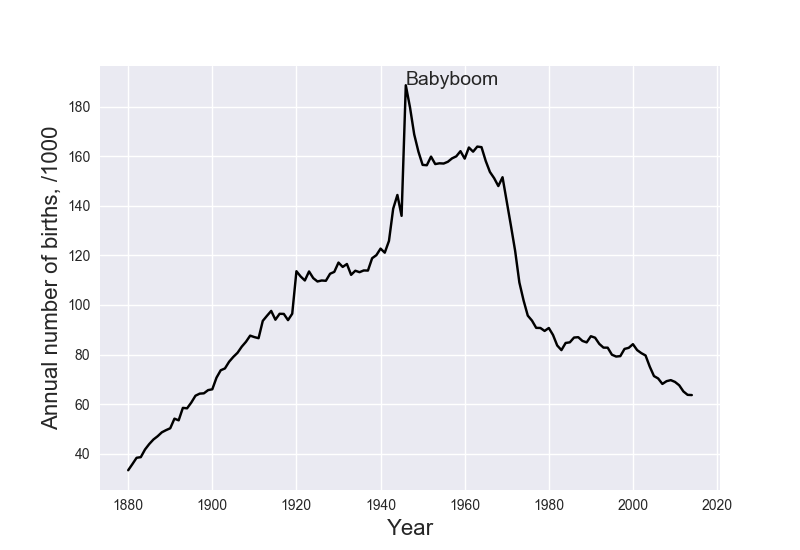
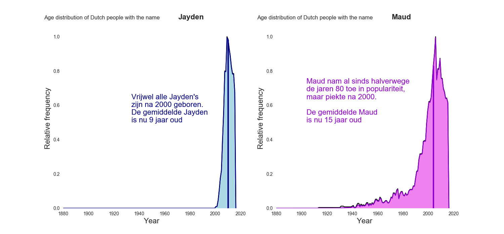
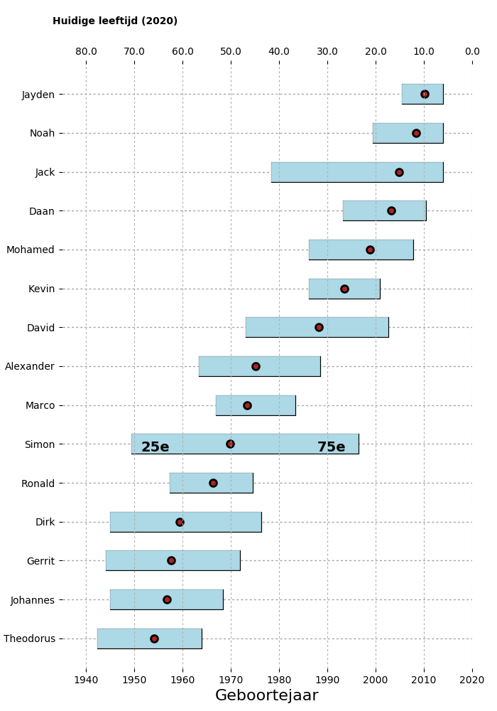
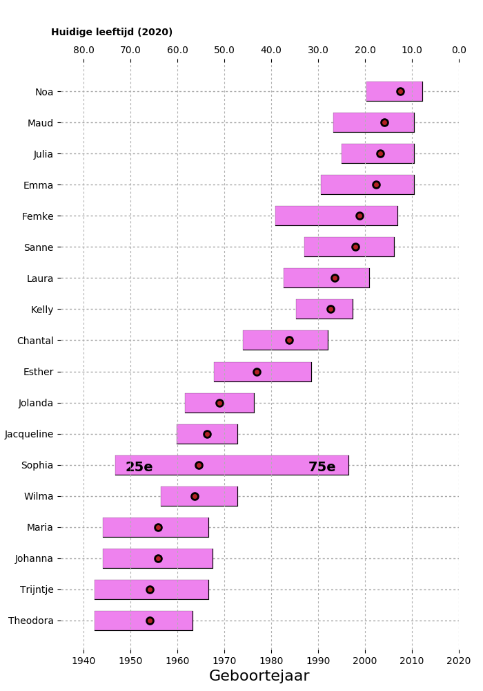
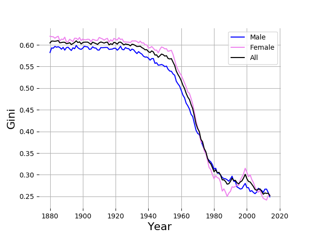
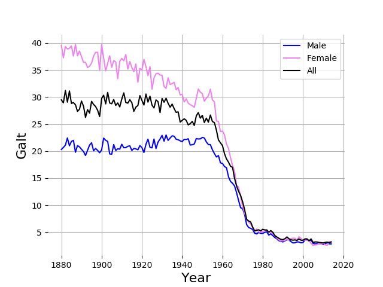
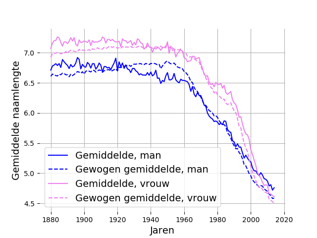
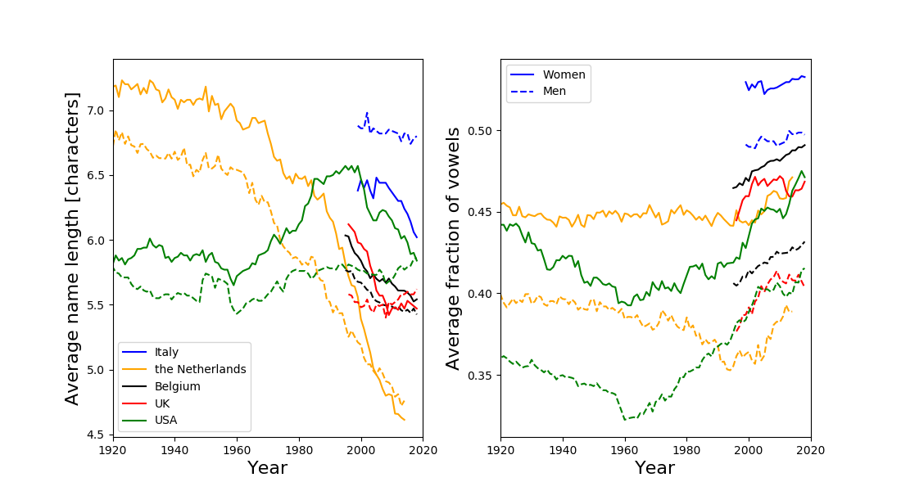

Since I have a baby daughter coming soon who needs a name, I would like to analyse baby names in the Netherlands. Maybe it will give me some inspiration.

Data is taken from de Voornamenbank from the Meertens Institute in the Netherlands. They publish lists of the most popular names in a given year (as far back as 1880), as well as the popularity of a given name through time.

The former is read in with simple scraping of the table. The latter is only published in a histogram, so that needs to be analyse and converted into data.

Let's have a look at the resulting dataset.

The zeroth-order thing we can do, is look at the total number of births over time. A small caveat here is that this only tracks the top-100 names in boys and girls (~200 names in total). The percentage of the total births that these reprents is unlikely to be constant over time (in particular, I would expect this to be a smaller percentage in recent years, as we will see later). Adding the total number of births would be a small, straightforward extension of the dataset. Most notably, in this figure we see:

Rising total births early on, corresponding to a rising population size.
The babyboom after the war is a significant spike in the number of births.
The number of births falls sharply after the 1960s, coinciding with the introduction of advanced anti-conception.
At the beginning of the 21st century the birth rates are similar to those at the beginning of the 20th century, but with a much larger population this represents a much lower fertility.

Next, we would like to know what happens to the popularity of specific babynames. Traditionally, the most popular names have been 'Johannes' for boys, and 'Maria' for girls. This was true for a long time, but started to change in the 1950s. This is shown in the black line below. When combined with survival statistics, we can find the colored histogram, which are all the people with those names that are still expected to be alive. If you meet a Johannes or a Maria, odds are they are a bit older.

The contrary is true if we look at Jaydens and Mauds. These names have been rising rapidly in popularity in recent years, with the average Jayden being 9 years old and the average Maud being 15. These statistics are somewhat skewed by the fact that the data only reaches up to 2014 - which is especially relevant for the 'younger' names.

The interesting thing about this, is that for many names you will be able to tell fairly accurately how old they are based only on the first name. As an example: one of my favorite comedians is called Ronald, and in one of his shows he tells us about his childhood crush - Jaqueline. Both of these names were very fashionable in the late 60s and early 70s. Indeed, Ronald Goedemondt was born in 1975.

Let's have a look at the ages of a set of different names, then. Here is a boxplot showing the median and 25th-to-50th percentile of people with a given name. First for the boys:

'Theodorus' is almost guaranteed to be old; Jayden's are young; and 'Simon' and 'Jack' are more timeless classics. Now for the girls:

'Theodora' is old, Maud is young, and Sophie's in the timeless classic here. Note the location of 'Ronald' and 'Jacqueline' in these graphs!

Then, we might ask ourselves the question how 'original' parents were with the names they gave their children, throughout history. We can quantify this by looking at the popularity of the top-100 names, and calculating 'inequality' statistics on these - much like people do in economic theory. Instead of income or wealth, the relevant attribute here is the number of babies with a given name. If all babies have only one name, that would be a perfectly inequal situation. Similarly, if the top 100 names all have the same number of babies associated with them, it's perfectly equitable. There are various inequality metrics in use, the ones that are incorporated in the dataset are:

The Gini index. Based on the shape of the cumulative wealth distribution. A Gini index of 1 means perfect inequality, 0 means perfect equality.
Palma ratio. Ratio between the top-10% and the bottom-40%.
Hoover index: the amount of wealth that would need to be re-distributed to achieve equality.
Galt score: the ratio between the 'CEO' (most popular name) to the median 'worker' (median name popularity)
20-20 ratio: the ratio between the top-20% and the bottom-20%.
In practice, many of these show a consistent picture. The Gini index looks like this:

The Gini index used to be much higher early on, and decreased with time. This means that parents used to be conservative in their naming: many babies carried a relatively small number of names. Contrarily, in recent years parents have become more original, and many names are carried by a small number of babies. This picture is very similar in girls and boys, with the girls names being slightly less original early on, but this difference disappears with time. If we then look at the Galt score, we see something similar, but the difference in the early 20th century between the genders is more stark. What we are seeing here is that a small number of names dominated in both girls and boys names, but if we look at the most popular names (Johannes and Maria), we see that Maria is even more strikingly popular than Johannes.

Finally, we can have a look at the average length of babynames. The figure below shows the average number of characters of babynames in a given year, both weighted (dashed) and unweighted (solid) by that name's popularity, and split for boys and girls. Things to note here:

Girls names used to be longer than boys names by about half a character for a long time. This can be understood in part from the fact that many old fashioned girls names were a boys name with a suffic - e.g. 'Geert' became 'Geertje'. Apparently this offset the fact that latin names tend to be shorter for women - e.g. Lucius and Lucia. This trend of longer girls names persisted until the turn of the millenium.
The average length of both girls and boys names decreased rapidly after the 1960s, by about 2 characters. Single-syllable names became very popular.

Finally, these trends are contrary to what is seen in the USA. In particular, name lengths did not change much there in the last 100 years, parents were not as 'conservative' at the turn of the 19th century. This can be understood from the larger variety in cultural backgrounds that cohabitated the US at that time.

Will this help me to name my daughter? Probably not.